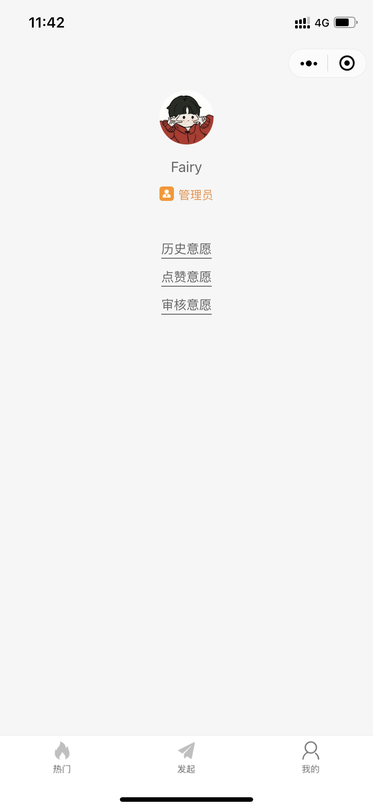
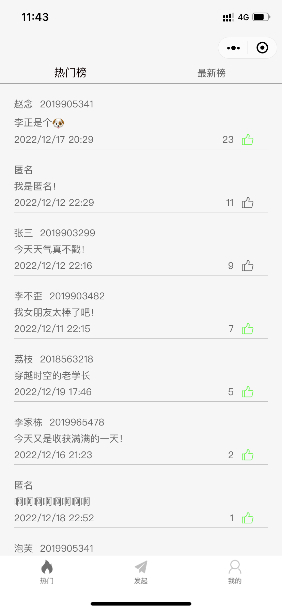
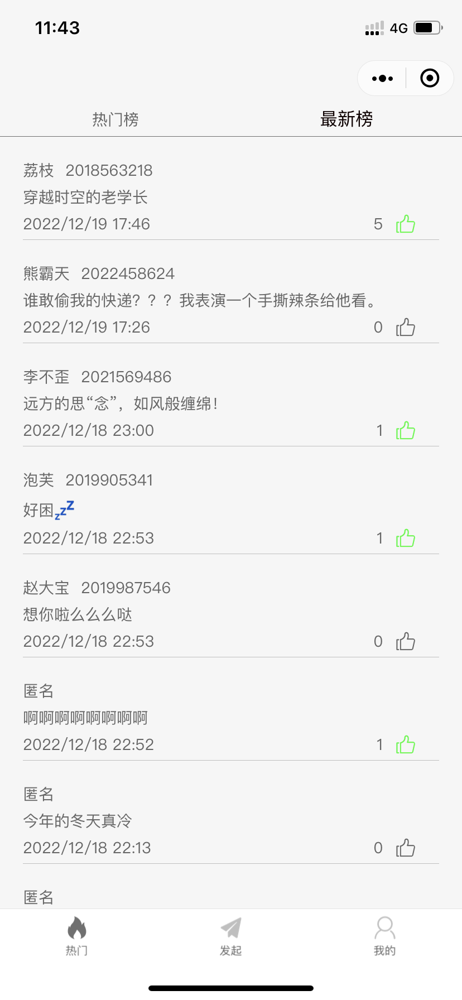
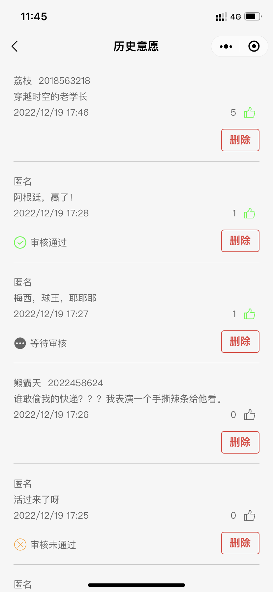
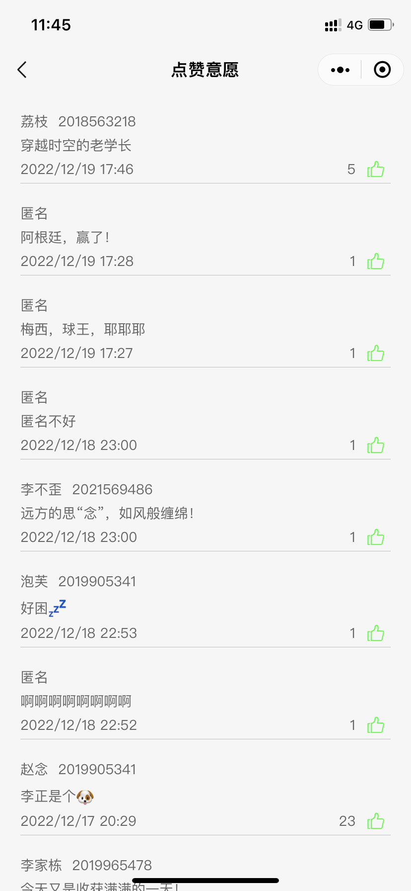
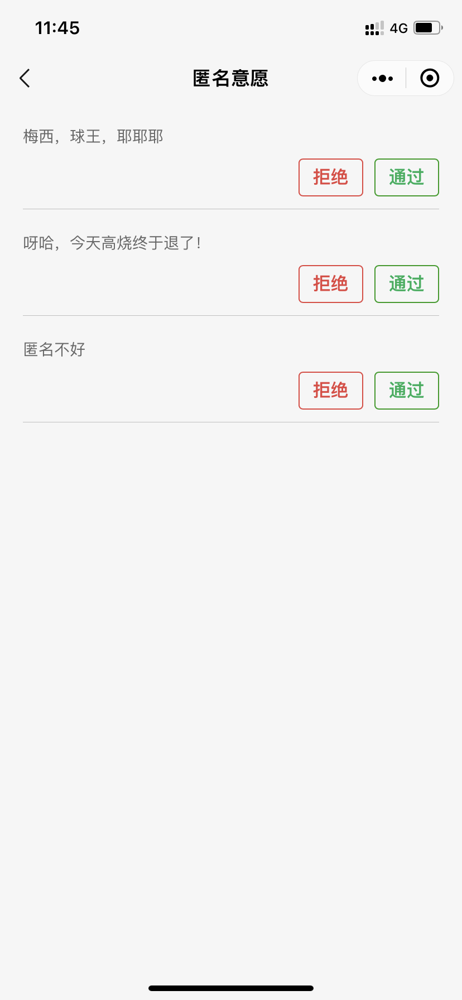

# 学生意愿收集系统

## 课设要求

### 微信小程序之学生意愿收集系统

#### **内容：**

关注学生需求，收集学生意愿。每个学生可作为意愿发起人，分为实名发起与匿名发起两种情况，匿名发起需经管理员审核。

#### **功能：**

1. 学生利用微信账号进行小程序登录。
2. 当发起人选择实名制意愿发起时，需要输入学号、姓名以及意愿简单描述。发起后，展示平台显示发起人信息。
3. 当发起人选择匿名制意愿发起时，只需输入意愿描述，但需经管理员审核是否通过。通过后，展示平台不显示发起人信息。
4. 意愿发起后，其他同学可进行投票，设计投票累计函数，每个登录账号对一个意愿只能投票一次。
5. 根据点赞数（即投票数）和意愿发起时间对意愿列表进行排序，对超过一定点赞数的意愿进行置顶排序，并标记为热门意愿。
6. 当无新点赞7日后，**非热门意愿自动删除**，热门意愿统计存储于往期热门意愿中。

## 完成情况

*2022/12/20* 目前开发基本完成前五条需求，对于第六条仍有待完善，主要是因为对于最新榜，热门榜，往期意愿的定义存在分歧。对于该项目，虽然自己之前有做过小程序，但是都是一年前的事了，所以刚上手有点生疏，进度有点慢，但是后面慢慢的熟悉起来，顺利了不少。

当然，其中最大的失误是一个项目总体规划的能力欠缺造成有些工作返工，就例如数据库的定义没有放在整个项目需求的前提下来定义，当时的想法就是先完成可见功能或者工作的数据库定义，到项目最后的时候，发现缺失了某些字段，数据表的联合查询效率较低等。

## 截图展示

1. 使用该小程序首先需要进行登录授权

2. 登录完成后，可以自定义用户头像、昵称，并且可以动态判断该用户是否具有管理员权限。

   

3. 热门中有热门榜和最新榜，可以对自己喜欢的意愿进行点赞。






4. 发起意愿中，有实名发起意愿和匿名发起意愿，实名意愿需要输入名字和学号，匿名需要管理员进行审核后才进行展示。


5. 用户可以查看自己的历史意愿，点赞意愿






6.  如果是管理员，会有审核意愿的功能和权限



## 数据库

table: wills

```json
{
    'openId':'',
    'stuId':'',
    'name': '',
    'willDes': '',
    'date':'', //year-month-day hour:minute 
    'audit': 0, //1->wait audit 2->pass 0->not pass
    'type': 0, //0->anony, 1->autony
    'hot':true, //false->no hot, true had hot 
    'thumbNum': 2
}
```

table: thumbs

```json
{
    'appId': '',
    'thumbId': 1
}
```


## 测试阶段

trends 测试：

| 测试名称                                       | 测试方法 | 是否通过      |
| ---------------------------------------------- | -------- | ------------- |
| 没有数据请求（第一次）                         |          | y(通过)       |
| 加载更多，没有数据                             |          | y             |
| 分页功能                                       |          | y             |
| 刷新功能                                       |          | y             |
| 热门榜请求的数据和最新榜请求的数据不一样？？？ |          | y             |
| 没有登录的逻辑                                 |          | y             |
| trends没有数据，没法刷新                       |          | y             |
| thumbs加载更多                                 |          | y             |
| 管理员的问题                                   |          | y             |
| 最新榜和热门榜切换的问题                       |          | y             |
| 登录逻辑的问题                                 |          | y             |
| 去除热榜的问题                                 |          | y             |
| 删除意愿效率提高                               |          | x（放弃）     |
| 取消点赞逻辑                                   |          | y             |
| showLoding过久                                 |          | y             |
| 字体适配                                       |          | y             |
| 定时刷新数据库                                 |          | y             |
| showToast?                                     |          | y             |
| 登录记录的信息有误（异步？）                   |          | w（等待测试） |
| 热门榜定义 最新榜定义                          |          | w             |
| 热门榜                                         |          |               |
| 最新榜                                         |          |               |
| 往期热门（修改thumbs数据库）                   |          |               |

### 待完成

1. 最新榜和热门榜的重新定义
2. 定时更新往期热门
3. 小程序多端显示文字动态适配

重新思考：

什么是最新榜： 72小时之内发布的

什么是热门榜：72小时内发布并且点赞数超过7的， 

往期热门： 超过72小时的点赞数超过7的（没有新点赞 24 小时内，就设为往期热门）

tag: v0.1.0

### 再修改

最新榜为按日期排序，发布近7天的意愿；

最热榜（应该以热度来衡量，而热度应该是单位时间内点赞数，那就是一天内的点赞数最多的进行排序，那么就会出现一个现象，热度最高的不一定是点赞数最多的，例如A和B都是昨天发布的，而昨天A获10赞，B获5赞， 显然A的热度比B的高，但是今天A获10赞，B获15赞，那么B的热度比A高，只看到今天之内的一个实时热度。当然，消除了夜间发布意愿的影响，因为都是24小时，这个算法并不完善，至少没有考虑到发布时间的考虑，因为夜间发布的意愿会）为3天内发布的，点赞数超过15的意愿，
