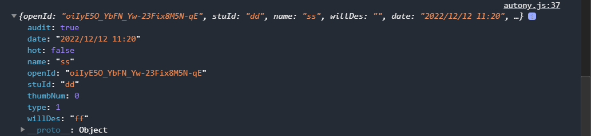

# 学生意愿收集系统

## 课设要求

### 微信小程序之学生意愿收集系统

#### **内容：**

关注学生需求，收集学生意愿。每个学生可作为意愿发起人，分为实名发起与匿名发起两种情况，匿名发起需经管理员审核。

#### **功能：**

1. 学生利用微信账号进行小程序登录。

2. 当发起人选择实名制意愿发起时，需要输入学号、姓名以及意愿简单描述。发起后，展示平台显示发起人信息。

3. 当发起人选择匿名制意愿发起时，只需输入意愿描述，但需经管理员审核是否通过。通过后，展示平台不显示发起人信息。

4. 意愿发起后，其他同学可进行投票，设计投票累计函数，每个登录账号对一个意愿只能投票一次。

5. 根据点赞数（即投票数）和意愿发起时间对意愿列表进行排序，对超过一定点赞数的意愿进行置顶排序，并标记为热门意愿。

6. 当无新点赞7日后，非热门意愿自动删除，热门意愿统计存储于往期热门意愿中。

## 数据库

table: wills

```json
{
    'openId':'',
    'stuId':'',
    'name': '',
    'willDes': '',
    'date':'', //year-month-day hour:minute 
    'audit': 0, //1->wait audit 2->pass 0->not pass
    'type': 0, //0->anony, 1->autony
    'hot':true, //false->no hot, true had hot 
    'thumbNum': 2
}
```



table: thumbs

```json
{
    'appId': '',
    'thumbId': 1
}
```

### rollback log:

12/11/2022 8:18  empty

```js
try{
    await db.collection('thumbs').add({
        data:{
              openId: event.openId,
              thumbId: event.thumbId,
          }
    })
    
    return await db.collection('wills').where({
        _id: event.thumbId
    }).update({
        data:{
            thumbNum: _.inc(1)
        }
    })

   }catch(e){
       return{
           success: false,
           errMsg: e,
       }
   }

//getDataListOfThumb:
exports.main = async (event, context)=>{
    return await db.collection('wills').aggregate()
    .lookup({
        from: 'thumbs',
        let:{
            openId: event.openId,
            thumbId: '$thumbId',
        },
        pipeline:$.pipeline()
        .match({
            _id: $$thumbId,
        })
        .project({
           value: true, 
           openId: false,
        })
        .done(),
        as: 'hasThumb',
    })
    .end()
}

 getDataList(listName, database, where, orderBy, skip){
        wx.showLoading({
            title: '正在加载',
            mask: true,
        }) 
        wx.cloud.callFunction({
            name: 'quickstartFunctions',
            config:{
                envId: app.globalData.envId,
            },
            data:{
                type: 'getDataList',
                database: database,
                where: where,
                orderBy: orderBy,
                skip: skip,
            }
        }).then((res)=>{
            console.log(res);
            if(listName == 'hostList'){
                this.setData({'listTable[0]': res.result.data, hotSkip: this.data.hotSkip+this.data.pageNum})
                //add hasThumbField
            }
            else if(listName == 'newList'){
                this.setData({'listTable[1]': res.result.data, newSkip: this.data.newSkip+this.data.pageNum})
                //add hasThumbField
            }
            wx.hideLoading();
        }).catch((e)=>{
            console.log(e);
            wx.hideLoading();
            wx.showToast({
              title: '请求错误',
              icon: 'error',
            })
        })
    },
```

## 测试阶段

trends 测试：

| 测试名称                                       | 测试方法 | 是否通过 |
| ---------------------------------------------- | -------- | -------- |
| 没有数据请求（第一次）                         |          |          |
| 加载更多，没有数据                             |          |          |
| 分页功能                                       |          |          |
| 刷新功能                                       |          |          |
| 热门榜请求的数据和最新榜请求的数据不一样？？？ |          |          |
| 没有登录的逻辑                                 |          |          |
| trends没有数据，没法刷新                       |          |          |
| thumbs加载更多                                 |          |          |
| 管理员的问题                                   |          |          |
| 最新榜和热门榜切换的问题                       |          |          |
| 登录逻辑的问题                                 |          |          |
| 去除热榜的问题                                 |          |          |
| 删除意愿效率提高                               |          | x        |
| 取消点赞逻辑                                   |          |          |
| showLoding过久                                 |          | -> y     |
| 字体适配                                       |          | y        |
| 定时刷新数据库                                 |          |          |
| showToast?                                     |          | y        |
| 登录记录的信息有误（异步？）                   |          |          |

